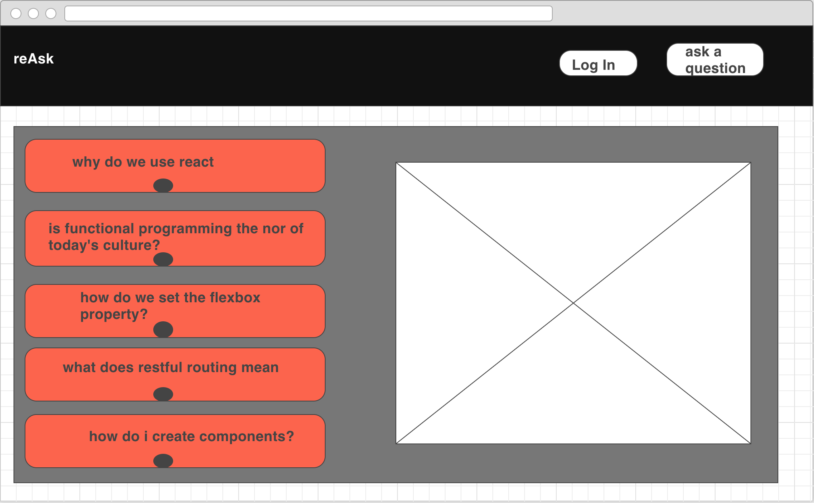

# Project-3 reAsk

General Assembly WDI NYC 60
November, 2016

#### Our Awesome Team
- Synclair Wang
- Natty Davis
- Mike Cohen
- Taka

## Description  
This application is a web service with live polling aimed at assisting education. The main goal is to have students write down their questions. These questions will be reflected on a public board for that classroom allowing other  students from the same class up-vote a question and give it more relevance so the teacher can answer the most pressing matters.

## User Story
Questions are used as an anonymous way to get students to open up about their doubts and having other people back them up if they have the same issue. Teachers choose solving those questions based now on relevance and how many students they could affect positively in the process. This helps teachers poll how many people grasp the knowledge they are imparting and can help them change the structure of their future classes based on that information

## Wireframes

## Technologies used
- [ ] React.js
- [ ] Node.js
- [ ] Express
- [ ] PSQL
- [ ] JSX
- [ ] CSS
- [ ] Restful Routing
- [ ] magic

## General Aproach
Using a React based app we will construct a website that uses restful routing to access a PSQL database. The database will be modified by the users that will add questions via their user endpoint. We will provide a temporary system for user login to differentiate between users and teachers.  
Questions in general will be anonymous to encourage openness and confidence in students. Students will not view who asked the question or up-voted the poll, but the teachers will be able to see that information.
Teachers will have administrator privileges and will also be able to complete a question once he considers it answered. Teachers will also be able to review questions made on previous sessions, providing.
In regards to the restful routing process, we will not implement a delete, but instead a soft delete to still have the queries saved for future reference of the teacher or the student that created it.
We will be using modals to insert information and

## ERDs

Questions | type |
--- | --- |
ID | SERIAL NOT NULL (primary key)
Timestamp | Current Date NOT NULL, DEFAULT CURRENT DATE
USERID | INTEGER NOT NULL (foreign key)
Votes | INTEGER, DEFAULT 0
QuestionBody | VARCHAR(255) NOT NULL
Type (open/closed) | VARCHAR NOT NULL, DEFAULT OPEN
Tags | VARCHAR, DEFAULT ''

Users | Type
--- | --- |
ID | SERIAL NOT NULL (primary key)
username | VARCHAR NOT NULL
GA course | VARCHAR NOT NULL
Email | VARCHAR NOT NULL
Password | VARCHAR NOT NULL
-Type (student, teacher, guest) | VARCHAR NOT NULL
